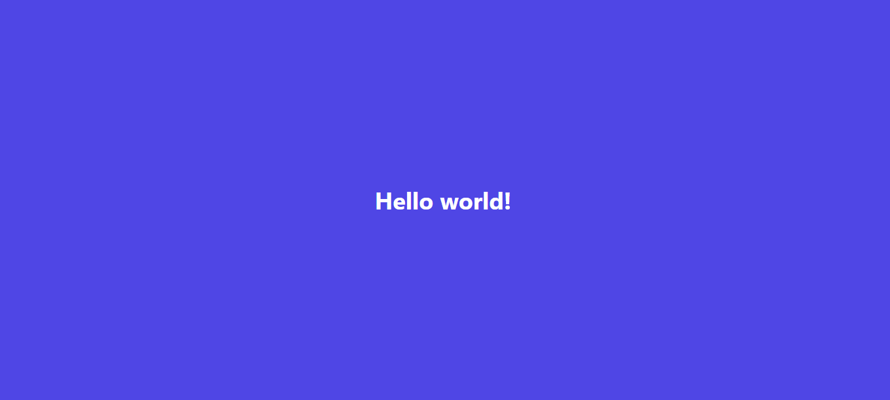

This project is a html version [startup-landing-template](https://startup-html-template.netlify.app/) designed with HTML & CSS. We use tailwindcss framework and some javascripts plugin. For slider we use swipper js.

Check the [Live Demo here](https://startup-html-template.netlify.app).




## Project Setup

```sh
npm install
```

### Compile and Hot-Reload for Development

```sh
npm run dev
```

### Compile and Minify for Production

```sh
npm run build
```

### Lint with [ESLint](https://eslint.org/)

```sh
npm run lint
```

## Credits
- Design by [Hasib](https://www.linkedin.com/in/)
## License
The MIT License (MIT). Please see [License File](LICENSE.md) for more information.
